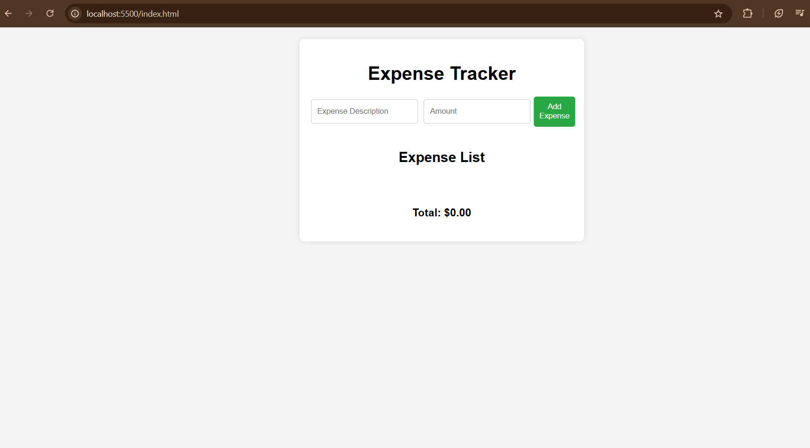
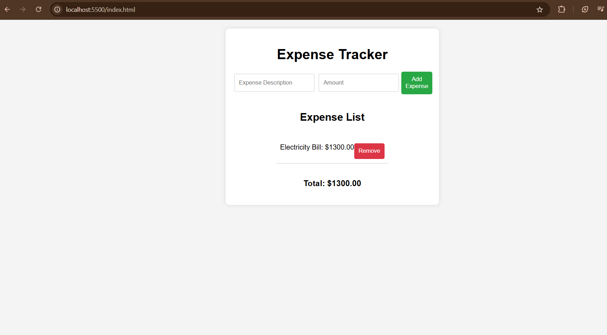

# Expense Tracker

A simple and intuitive Expense Tracker application built with HTML, CSS, and JavaScript. This application allows users to easily record and manage their expenses, providing a clear overview of their spending habits.

## Features

- Add new expenses with descriptions and amounts.
- View a list of all recorded expenses.
- Remove expenses as needed.
- Automatically calculate and display the total expenses.

## Technologies Used

- HTML5
- CSS3
- JavaScript

## Installation

To get started with this project, follow these steps:

1. **Clone the repository**:
   ```bash
   git clone https://github.com/yourusername/expense-tracker.git
   ```

2. **Navigate to the project directory**:
   ```bash
   cd expense-tracker
   ```

3. **Open the `index.html` file** in your web browser:
   ```bash
   open index.html
   ```
   Or simply double-click the `index.html` file in your file explorer.

## Usage

1. Enter a description for your expense in the input field.
2. Enter the amount of the expense.
3. Click the "Add Expense" button to add the expense to the list.
4. View the list of expenses and the total amount.
5. Click the "Remove" button next to an expense to delete it.

## Screenshots




## Contributing

Contributions are welcome! If you'd like to contribute to this project, please follow these steps:

1. Fork the repository.
2. Create your feature branch:
   ```bash
   git checkout -b feature/YourFeatureName
   ```
3. Commit your changes:
   ```bash
   git commit -m "Add some feature"
   ```
4. Push to the branch:
   ```bash
   git push origin feature/YourFeatureName
   ```
5. Open a pull request.

## License

This project is licensed under the MIT License - see the [LICENSE](LICENSE) file for details.

## Acknowledgements

- Inspiration and design ideas were derived from various online resources.
- Thanks to everyone who contributed to this project!
```

You can copy and paste this snippet directly into your `README.md` file. Just remember to update any placeholder information (like the repository URL and screenshot path) to reflect your actual project details. Let me know if you need any further modifications or additional sections!